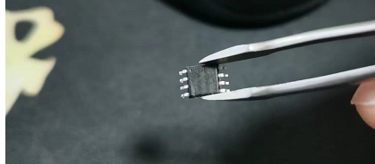

# 1.固件概述

​		固件就是写入EROM(Eraseable Read-only Memory，可擦只读存储器)或者EEPROM(Electrically Erasable Programmable Read-Only Memory，电可擦除可编程只读存储器)中的程序。 固件承担系统最基础和底层的工作，是硬件设备的灵魂，决定着硬件设备的功能及性能。

​	   通常情况下，硬件中保存的固件程序是无法被用户读出的。之前的固件因为采用ROM设计，固件代码在生产过程中固话写死，所以固件升级，bug修复只能拆换芯片固件。随着技术的发展，可以重复写入的EPROM、EEPROM、和flash出现了。这些芯片可以重复擦写，固件得以修改和升级。

​	   固件可以理解为操作系统，包括很多模块，如驱动，控制，解码，传送，检测........只有在他的控制下，硬件才可以正常工作。

​	  任何数码设备都有固件，只是平常感觉不到。如手机、数码相机、MP3、MP4、路由器、PS游戏机、XBOX、U盘、主板、显卡的BIOS。更比如一些小型设备的固件如鼠标、键盘、显示器、光驱、硬盘、GPS终端、以及其他精密的电子仪器等。

​        固件也是软件，大小不一。大的可以几百兆，小的可能只有几字节。

​        对于独立可操作性的电子产品。固件一般指操作系统。比如PSP（掌上游戏机）的固件，就是PSP的操作系统。iphone手机的固件也是其操作系统，路由器的固件也是路由器的操作系统，MP4的固件也是MP4的操作系统。

​        对于非独立的电子产品，比如硬盘，鼠标，BIOS、光驱、U盘等设备。固件指的是最底层让设备得以运行的程序代码。

​		在大部分IOT产品中多采用 flash 芯片作为存储器，提取固件主要也是通过读取 flash 芯片

# 2.固件获取方式

​	常见的固件获取方式有4种。

- 官网提供固件包，网络下载。
- 设备升级，抓包获取固件url
- 调试串口获取
- 通过硬件，暴力读取固件存储芯片数据。

## 2.1 公开资源下载

TP-Link路由器固件  [Link](https://service.tp-link.com.cn/download?classtip=software&p=1&o=1)

小米路由器固件(ROM) [Link](http://www.miwifi.com/miwifi_download.html)

华硕ASUS路由器固件 [Link](https://www.asus.com.cn/support/Download-Center/)

腾达路由器 [Link](https://www.tenda.com.cn/service/download-cata-11-2.html)

## 2.2 网络升级获取

​      官网提供固件下载的获取方式多用于手机，路由器，相机等设备固件获取，而大多数IOT设备的官网，没有直接提供下载链接。这时可以通过分析手机，APP端是否有固件更新功能或者直接抓取终端设备的网络数据包，提取固件更新URL。

​      当设备进入升级流程时，可以通过抓取升级过程的流量信息，进而得到物联网设备通过网络升级固件的具体途径。

如上图：白色的为家庭正常使用的华为AX3路由器，蓝色的为tp-link老款路由器。

- 将蓝色路由器使用网线连接到电脑，配置好无线ID，密码以及自动获取ip的上网方式。
- 网线一端连接白色路由器的任一网口，一端连接蓝色路由器的wlan口。
- 电脑连接蓝色路由器的WiFi，登录tplogin.cn后台控制页面。
- 查找软件升级的点击按钮，如下
- 查找本机无线局域网ip

- 使用burpsuite设置本地代理

- 浏览器设置本地代理

- 点击页面上的升级按钮

- burpsuite 查看数据包中是否返回了固件信息

## 2.3 调试接口获取

### 2.3.1 如何定位UART串口

UART (Universal Asynchronous Receiver Transmitters )通用异步收发器。它将要传输的资料在

从串口（UART）通信和并行通信之间相互转换。对于物联网的串口调试，多数指的是通过uart口进行数据通信。UARt包含有以下4个引脚

- GND：接地，该引脚电压通常为0。
- VCC：电源电压。
- TXD：数据发送引脚
- RXD：数据接收引脚

TXD和RXD常与一般直接与处理器芯片的引脚相连。

vcc电压几乎不是3.3V就是5V。

正好有4个孔，怀疑是UART串口。

**目测法**

（1）VCC引脚特点

​	VCC引脚通常被做成方形，从路由器主板上可以看到较宽的走线。

（2）GND引脚

​    GND引脚通常存在多条走线连接到周围的地线（GND）

**万用表测量法**

（1）**测试GND引脚**

  GND至少和一根外接天线是连接相通的，将万用表的档位调至蜂鸣档，一直表置于天线的锡焊点，一只表去试探串口，发出蜂鸣声的，则是GND。

方法1：pbc板不上电，万用表调至蜂鸣档位。一个表笔接（电容器负极，pbc板输入电源负极，或者pbc上的锡点），另一个表笔来探测GND引脚。如果是GND引脚，万用表会发生声音，指示灯会变红。

​	方法2：将万用表调到电阻测量的最小档。这里最小为200欧姆，因此选择电阻为200欧姆的档位。然后确定两个表笔位置。金属屏蔽是一个很好的接地点，因此将一只表笔放在金属屏蔽罩上，另一表笔分别接触各个引脚，电阻为0的引脚是GND引脚。     

在测试其他孔位时，仪表没有任何数据变化，只有探测第三个孔的时候，仪表有数据变化。

可知pbc板上的第二个孔为GND(cong)

（2）**测试VCC**

给路由器上电，然后万用表量程放在直流电压20V的档位上，从路由器启动到系统完全启动观察电压值基本稳定在3.3V。一只表放在GND上，测试其他哪只引脚为3.3V，该引脚则为VCC。

或者等启动稳定后，黑色表笔探头接到GND，红色探头取检测UART的各个针脚。如果哪个针脚能够出现恒定3.3V或者5V。则说明这个针脚是VCC。

下图为启动稳定后的探测结果。

可以发现第一个孔是VCC（从左向右）

（3）**测试TXD引脚**

​	方法1：当串行端口处于激活状态并发送数据（否则无法测试出发送引脚）时，发送引脚很容易识别。主板上的发送引脚被拉高到与VCC引脚相同的电压时，通常为3.3V。在有数据发送时，电压将下降到0。当读取的是一个不断变化的直流电压时，数字万用表将显示最终的**平均采样电压**。

   方法2：如果万用表显示引脚电压下降，表示引脚有数据发送，由此可判断是TXD引脚。所以在启动过程中的10-15秒内，TX针脚会引起比较大的电压波动。因为启动的过程中有很多数据需要传输，方法和寻找VCC针脚的相同。

<video id="video"  width="320" height="280">
      <source id="mp4" src="./photo1/txd.mp4" type="video/mp4">
</videos>

从电源上电到稳定，数据是一个波动的状态，很明显第4个孔是TXD（从左向右）

（4）**测试RXD引脚**

该引脚没有什么固定特征。通常都是找到其他三个引脚，剩下的那个就是RXD引脚。

**综上：可以分析得出四个孔位从左到右分别是：VCC  GND   RXD   TXD**

### 2.3.2  USB_TO_TTL

找到了UARt口，也有了USB转TTL工具。但是PBC板上UART是四个孔，需要焊接排针。但由于排针数量较少，而且焊接也不是很方便。就直接将排针插到4个孔里面，然后使用USB  to TTL (电平信号转换)。要注意以下引脚对应关系。

1、**GND引脚对应TTL的GND**

2、**RXD引脚对应TTL的TXD**

3、**TXD引脚对应TTL的RXD**

不然usb_to_ttl上的rxd指示灯会显示红色。然后使用putty、xshell等串口工具链接

（1）将usb_to_ttl插入电脑usb口，打开设备管理器，查看COM口。

 (2) 打开串口连接工具，填入常见使用的数据传输波特率。9600、115200连接。

​     现象就是有乱码，起初怀疑是引脚与杜邦线的接触不良，毕竟没有焊接。但是顺手去查了这个型号路由器的波特率，发现波特率可能是128000或者57600。填入12800。

泪目，真的研究了好久。终于进入shell了。但经过研究后，发现没有什么好dump内存的方式。flash可以看到内存布局。但是不知道内存加载的起始地址。等后续在研究。

## 2.4 编程器获取

这里利用编程器直接读取芯片固件，常用两种方法：

- 飞线或者使用芯片夹，连接编程器，进行在线数据读取。
- 把芯片拆焊下来，通过烧录座编程器，离线读取固件。

所用到的工具有：

- 编程器，常见的RT809H(900元左右)，入门略贵，这里用的是VS4000P（2百多）

- 芯片夹。一端卡住单板上的芯片，一端的针插入编程器上。

- 烧录座 （卡住芯片，固定在编程器上）

- 飞线，杜邦线
- 热风枪（推荐深圳白光，胜利仪器）

- 镊子

### 2.4.1 免拆芯片提取固件

- **查看芯片上的丝印，查看型号。以便在编程器支持的芯片列表中查询。**

型号为25Q16CS1G

- **打开编程器对应的应用程序，查看芯片支持列表**

有很多个25Q16，但具体是什么开头的还不清楚。网上百度下

型号确定：GD25Q16

有三个不知道咋选，SOP8知道意思，但后面的150和200，不知道啥意思，干脆一个一个挨着试。

- 芯片夹卡住芯片，并连接编程器。

- 实验一

- 实验二

- 实验三

麻了，麻了！！！

### 2.4.2  使用飞线法读取

​     通过夹具夹住芯片引脚，然后连接编程器读取芯片内容，通过编程器连接芯片需要注意引脚的顺序，在 IC 芯片上都会有一个小点，大多数情况下，小点对应的引脚即为芯片的第一脚，而连接编程器的导线也需要插入编程器上相应的引脚。

目前手里只有这种小夹子，只能暂时先用。连接后如下

使用编程器读取数据

啊这。。。。。

### 2.4.2  拆焊芯片读取固件

这下只有把芯片从pbc板上拆下来，然后使用烧录座读取数据。

- 热风枪设置到合适的温度，吹下芯片，要注意不要灼烧到周围的元器件。

 

热风枪的使用就要经验，最开始吹了半个小时没有动，各种查资料。后来干脆温度，风速调到最大，去吹另一块板子上的芯片，两下就掉了。

原因是：热风枪温度还没有上来就去吹芯片，导致融锡的温度和热风枪的温度同步上升。后来温度风速稳定，去吹冷板子上的芯片一下就掉了。

- 拆下的闪存芯片放在烧录座上，在连接编程器进行读写，芯片放置的引脚方向要注意对齐编程器和烧录座的第一脚。

- 读取数据

有数据了。再次泪目！！！

# 参考链接

http://blog.nsfocus.net/security-analysis-of-the-firmware-of-iot/

[树莓派读取](https://www.anquanke.com/post/id/227285)

[获取root](https://x1ng.top/2020/12/06/%E5%AD%A6%E4%B9%A0%E6%8B%86%E6%9C%BA%E8%B0%83%E8%AF%95%E8%B7%AF%E7%94%B1%E5%99%A8/)